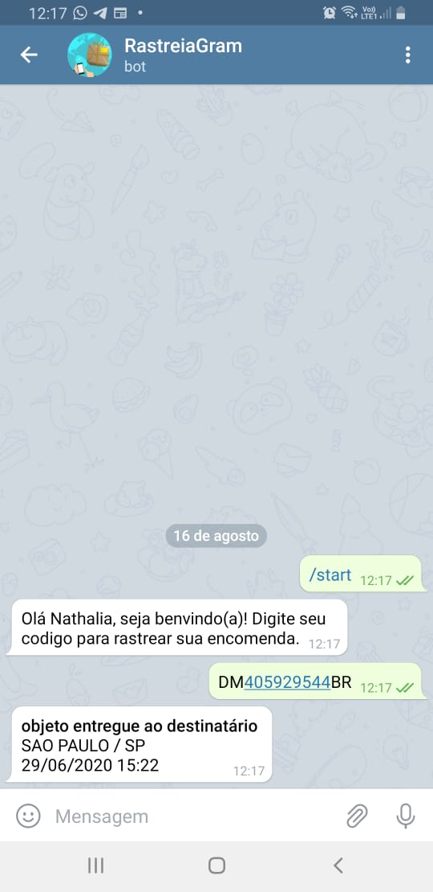

<h3 align="center">
RastreiaGram: Um chatbot do Telegram para rastrear suas encomendas.
</h3>

<p align="center">
  <a href="#computer-sobre-o-projeto">Sobre o projeto</a> | <a href="#rocket-tecnologias">Tecnologias</a> | <a href="#books-guia-de-instalação-e-execução">Guia de instalação e execução</a> | <a href="#page_with_curl-licença">Licença</a>
</p>

## :nail_care: Preview

<p align="center">
  
</p>

## :computer: Sobre o projeto

<p>O RastreiaGram é um chatbot do Telegram para rastreiar suas encomendas do Correios de maneira rápida e simples. 
Basta enviar seu código de rastreio que ele trará o último status de atualização.</p>

## :rocket: Tecnologias
 
- [Node](https://nodejs.org/en/)
- [Typescript](https://www.typescriptlang.org/)
- [Node Telegram Bot Api](https://github.com/yagop/node-telegram-bot-api)
- [Rastrojs](https://github.com/talesluna/rastrojs)
- [Date-fns](https://date-fns.org/)
- [Random-js](https://github.com/ckknight/random-js)
- [Dotenv](https://github.com/motdotla/dotenv)

## :books: Guia de instalação e execução

### Pré-requisitos

- [Git](https://git-scm.com/)
- [Node.js](https://nodejs.org/en/)
- [Yarn](https://yarnpkg.com/)

### Como executar

***Você deve criar um bot no BotFather do Telegram antes dessa etapa, se você não sabe como fazer [clique aqui](https://medium.com/tht-things-hackers-team/10-passos-para-se-criar-um-bot-no-telegram-3c1848e404c4)***

- Clone o repositório ```git clone https://github.com/nathaliacristina20/rastreio-chatbot-telegram.git```
- Vá até o diretório ```cd rastreio-chatbot-telegram```
- Execute ```yarn``` para instalar as dependências
- Copie o arquivo .env.example executando ```cp .env.example .env``` para linux ou mac e ```copy .env.example .env``` para windows
- Abra o arquivo .env e preencha com seu token obtido pelo BotFather
- Execute ```yarn dev``` para rodar o servidor

## :page_with_curl: Licença

Esse projeto está sob a licença MIT. Veja o arquivo <a href="https://github.com/nathaliacristina20/rastreio-chatbot-telegram/blob/master/LICENSE">LICENSE</a> para mais detalhes.

<hr />
<p>by Nathalia Cristina :wave: <a href="https://linktr.ee/nathaliacristina20">Get in touch!</a></p>
